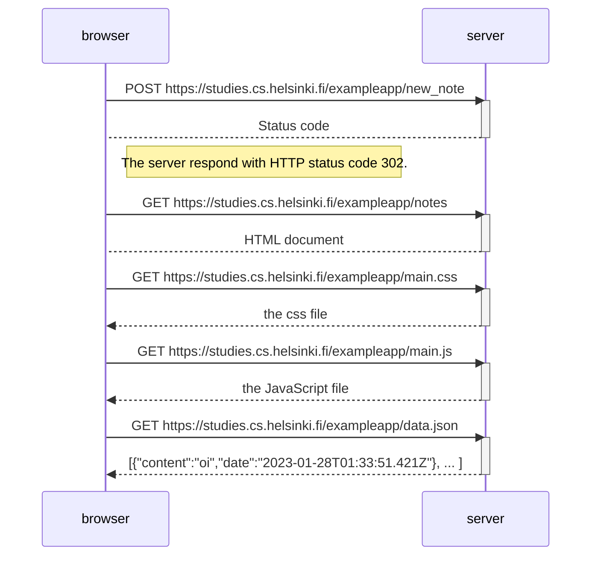

```mermaid
sequenceDiagram
    participant browser
    participant server

    browser->>server: POST https://studies.cs.helsinki.fi/exampleapp/new_note
    activate server
    server-->browser: Status code 
    deactivate server

    Note right of browser: The server respond with HTTP status code 302.

    browser->>server: GET https://studies.cs.helsinki.fi/exampleapp/notes
    activate server
    server-->browser: HTML document
    deactivate server

    browser->>server: GET https://studies.cs.helsinki.fi/exampleapp/main.css
    activate server
    server-->>browser: the css file
    deactivate server
    
    browser->>server: GET https://studies.cs.helsinki.fi/exampleapp/main.js
    activate server
    server-->>browser: the JavaScript file
    deactivate server

    browser->>server: GET https://studies.cs.helsinki.fi/exampleapp/data.json
    activate server
    server-->>browser: [{"content":"oi","date":"2023-01-28T01:33:51.421Z"}, ... ]
    deactivate server  
```