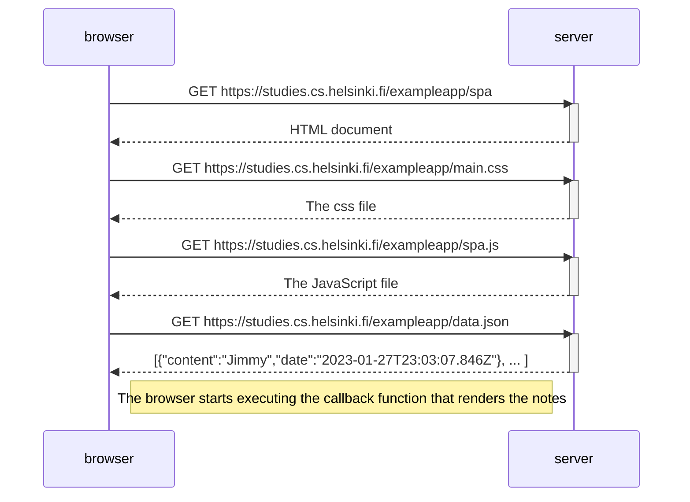

```mermaid
sequenceDiagram
    participant browser
    participant server
    
    browser->>server: GET https://studies.cs.helsinki.fi/exampleapp/spa
    activate server
    server-->>browser: HTML document
    deactivate server
    
    browser->>server: GET https://studies.cs.helsinki.fi/exampleapp/main.css
    activate server
    server-->>browser: The css file
    deactivate server
    
    browser->>server: GET https://studies.cs.helsinki.fi/exampleapp/spa.js
    activate server
    server-->>browser: The JavaScript file
    deactivate server
        
    browser->>server: GET https://studies.cs.helsinki.fi/exampleapp/data.json
    activate server
    server-->>browser: [{"content":"Jimmy","date":"2023-01-27T23:03:07.846Z"}, ... ]
    deactivate server    

    Note right of browser: The browser starts executing the callback function that renders the notes

```